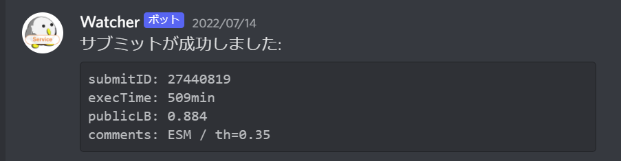

# kaggle-watch
kaggle apiを利用してNotebook Submitの際に送信情報を監視し, 実行時間等を取得するためのツール.  
SlackやDiscordのWebhook機能を利用してLBや実行時間等を含めてメッセージを送信する.  
  
  
[コンペ](https://www.kaggle.com/competitions/uw-madison-gi-tract-image-segmentation) での活用例.  
9時間(540分)の制限に対してあと程度処理が可能かなどの参考になった.  

## Discord の設定

事前にkaggle APIを実行可能にしておくこと.

1. 監視ログを送信したいDiscrodサーバー/チャンネルでWebhookを作成  
1. Webhook作成時のURLを取得  
1. config.jsonにURLおよびコンペIDを記載  
1. 実行  
