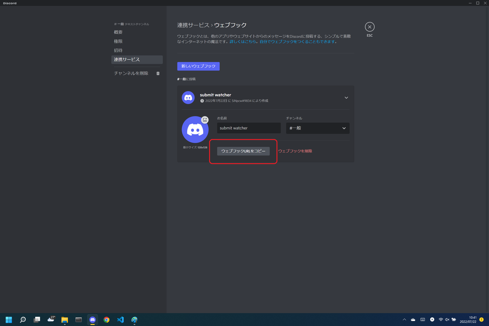

# kaggle-watch
kaggle apiを利用してNotebook Submitの際に送信情報を監視し, 実行時間等を取得するためのツール.  
SlackやDiscordのWebhook機能を利用してLBや実行時間等を含めてメッセージを送信する.  
  
  

[コンペ](https://www.kaggle.com/competitions/uw-madison-gi-tract-image-segmentation)での活用例.  
9時間(540分)の制限に対して, あと程度処理が可能かなどを検討する際に有用であった.  

## Discord の設定

<font color="#ff0000">**注意**</font>  
事前にkaggle APIを実行可能および認証情報を取得していることが必要になる.  
  
### 1. 監視ログを送信したいDiscrodサーバー/チャンネルでWebhookを作成  
  
  
### 2. Webhook作成時のURLを取得  
  

  
  
### 3. コード設定
現状は main.py のコードを編集してWebhook送信先URLおよびコンペIDを編集する.  

  
### 4. 実行  
```bash
python main.py
```
  
## TBD
現行コードではpythonファイルにリテラルで記述しているが,  
将来的にはconfig.jsonにURLおよびコンペIDを記載する形式に変更を予定している.  
